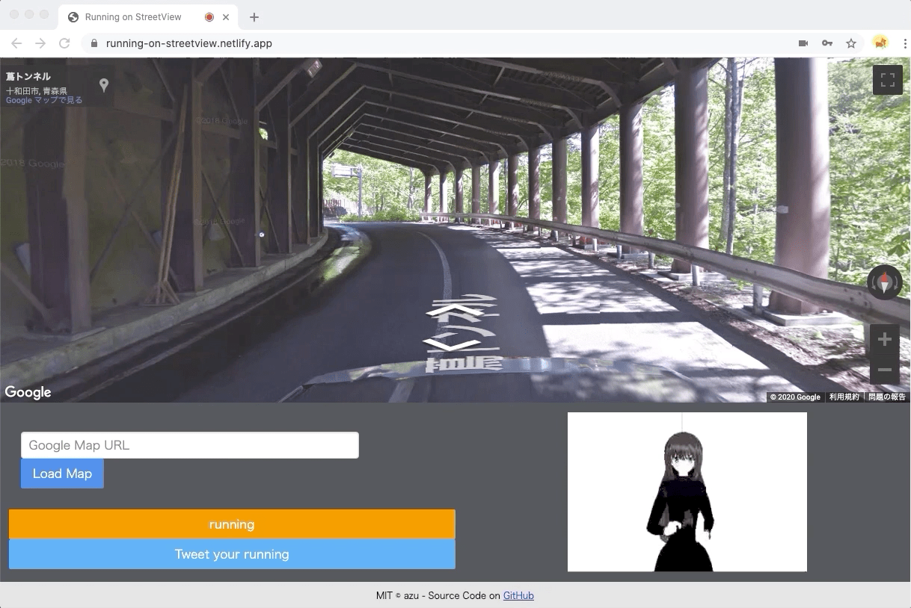

# running-on-streetview

Running on Google Street View.

## Requirements

- [ ] [Google Maps JavaScript API Key](https://developers.google.com/maps/documentation/javascript/get-api-key)
- [ ] A Browser that can use Web Camera
    - Tested on Google Chrome and Macbook Pro
 
## Usage

1. Open URL: <https://running-on-streetview.netlify.app>
2. Input your Google Map API Key
3. Load Google Map Street View and Running!

## How to get Google Map API Key?

You can get Google Map API from Google Cloud Platform Console.

- [Get an API Key  |  Maps JavaScript API  |  Google Developers](https://developers.google.com/maps/documentation/javascript/get-api-key)
- [Google Maps PlatformのAPIキーの取得・発行について - 株式会社ゼンリンデータコム](https://www.zenrin-datacom.net/business/gmapsapi/api_key/index.html)

## Tips

### Shortcut

- <kbd>↑</kbd>: Go forward
- <kbd>←</kbd>: Turn left
- <kbd>→</kbd>: Turn Right
- <kbd>↓</kbd>: Go back forward

### URL Hacking

This app support some url parameters:

- defaultMapUrl
- defaultForwardStep
- throttleBackward
- throttleForward

For more details, see [src/bootstrap.ts](src/bootstrap.ts)

## Changelog

See [Releases page](https://github.com/azu/running-on-streetview/releases).

## Running tests

Install devDependencies and Run `npm test`:

    npm test

## Contributing

Pull requests and stars are always welcome.
Documentation improvements is also welcome!

For bugs and feature requests, [please create an issue](https://github.com/azu/running-on-streetview/issues).

1. Fork it!
2. Create your feature branch: `git checkout -b my-new-feature`
3. Commit your changes: `git commit -am 'Add some feature'`
4. Push to the branch: `git push origin my-new-feature`
5. Submit a pull request :D

## Author

- [github/azu](https://github.com/azu)
- [twitter/azu_re](https://twitter.com/azu_re)

## License

MIT © azu

## Sponsors
          

## Acknowledgements

- [GoogleStreetViewを足踏みで仮想散歩するPGM - Qiita](https://qiita.com/shizuoka_miyako_19911118/items/90553c64d2b6b7d888ec)
